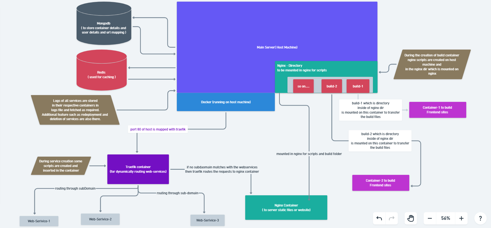
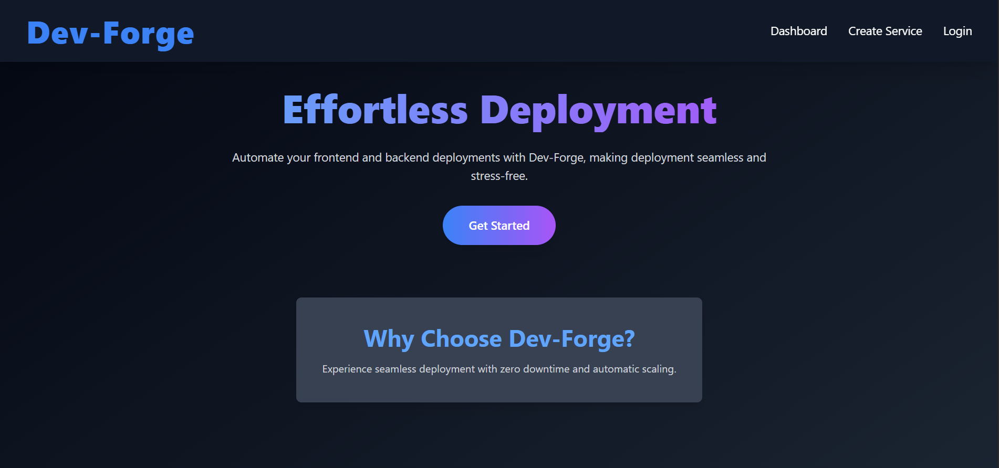
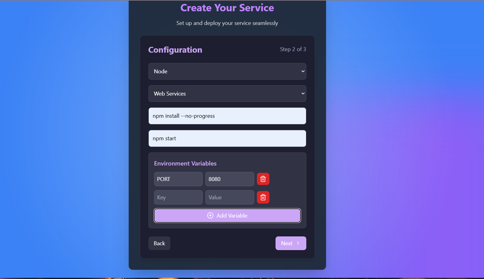
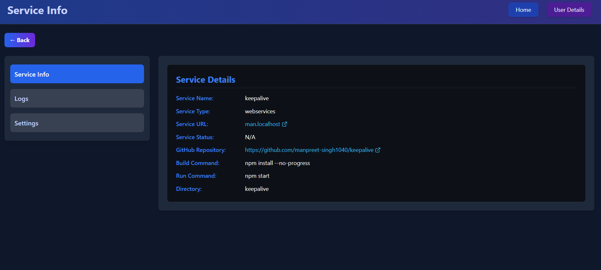
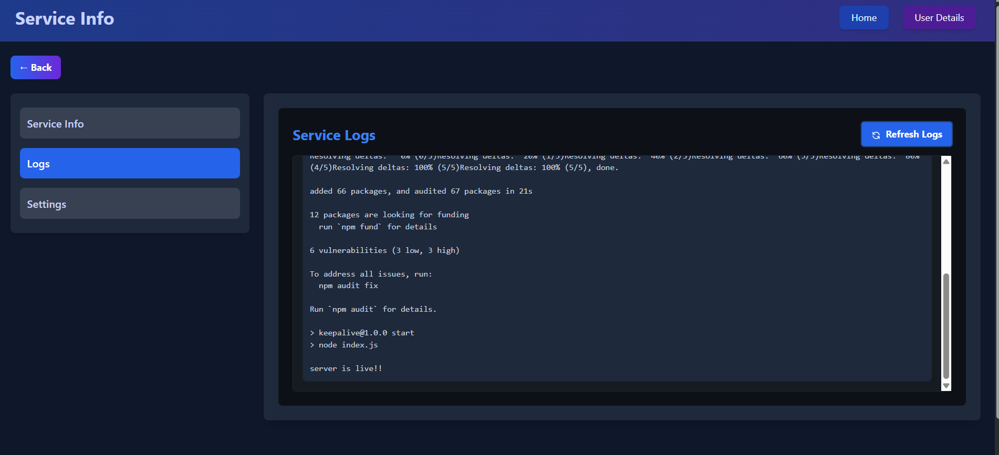

# 🚀 Dev-Forge

Dev-Forge is a full-stack deployment platform that allows users to easily deploy their frontend and backend applications in isolated Docker containers. The platform handles everything from cloning a GitHub repository to serving your app with a live domain — all without writing a single line of infrastructure code.

## 🧠 Features

- 🌐 Deploy frontend and backend apps via GitHub URL
- 🐳 Containerized environments for every app
- ⚡️ Real-time build status and logs
- 🔀 Traefik-powered dynamic routing (e.g., `yourapp.dev-forge.tech`)
- 🔁 Redis-powered queuing for smooth request handling
- 🗂 Centralized dashboard to manage deployments
- 💾 MongoDB for persistent storage of user data and app info
- 📜 Built-in Nginx + Dockerfile detection and support

## 📸 Demo

### 📌 Architecture Overview

### 🖥 Platform UI
#### Landing Page  
  
#### Build Process  
  
#### Deployment Success  
  
#### App Preview  
  
#### Logs View  

## 🛠 Tech Stack

| Layer       | Tech                     |
|------------|--------------------------|
| Frontend   | React, Tailwind CSS      |
| Backend    | Node.js, Express         |
| Database   | MongoDB                  |
| Queue      | Redis                    |
| Container  | Docker                   |
| Proxy      | Traefik , Nginx          |

## ⚙️ How It Works

1. **User submits GitHub link + project type (frontend/backend).**
2. **Backend pushes request into Redis queue.**
3. **Worker picks it up, clones repo inside container, builds, and runs it.**
4. **Traefik dynamically maps the container to a unique subdomain.**
5. **User sees live logs and a success message with their live URL.**

## 🧪 Environment Variables

The .env file for backend should look like

 | PORT                   |
 | MONGO_PORT             |
 | ROOT_PATH              |
 | JWT_SECRET             |
 | REDIS_PORT             |
 | GITHUB_CLIENT_ID       |
 | GITHUB_CLIENT_SECRET   |

